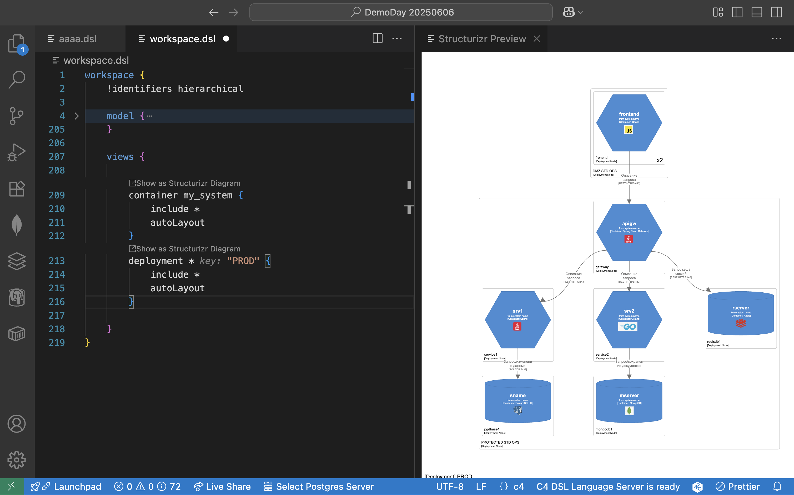
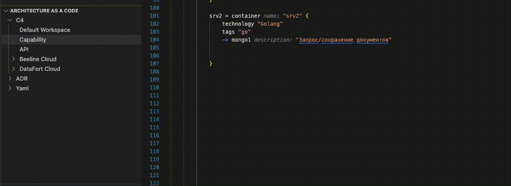
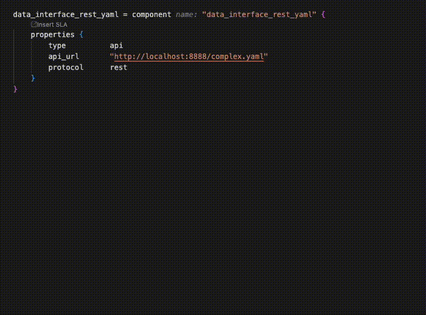
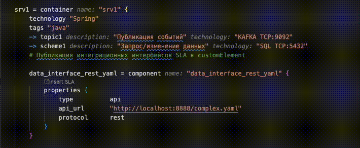
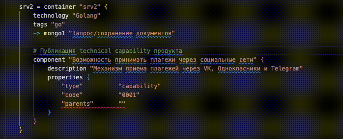
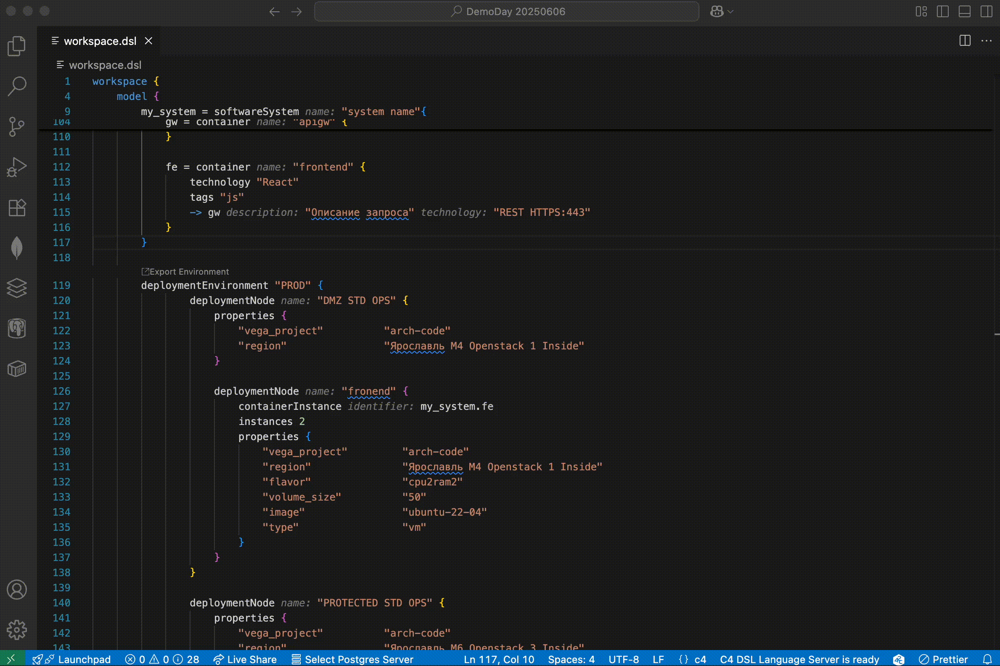
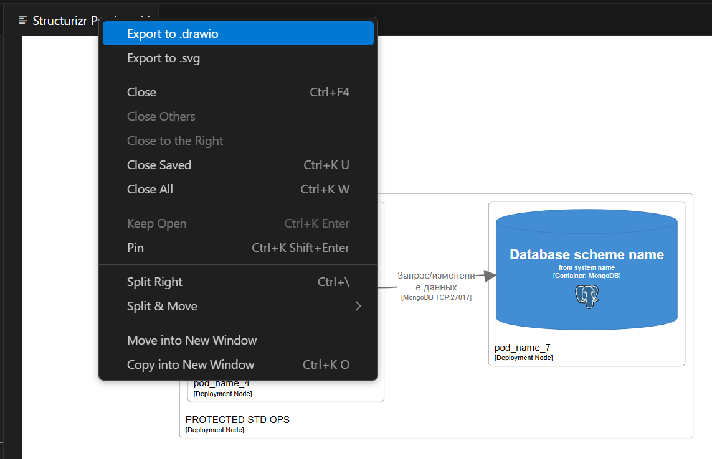

# C4 DSL Model Extension for Visual Studio Code
[](https://github.com/tech-beeline/varp/actions/workflows/main.yaml)
## Overview

This Visual Studio Code extension enables software architecture modeling using the [Structurizr DSL](https://github.com/structurizr/dsl). The Structurizr DSL implements the "diagrams as code" approach ([learn more](https://docs.structurizr.com/)) and provides a textual representation of the [C4 model](https://c4model.com/).

The extension includes:
- A language server built on the official [Structurizr DSL](https://github.com/structurizr/java/tree/master/structurizr-dsl) parser
- Advanced capabilities for architectural description automation
- Syntax highlighting and validation
- Text decorations
- Go to Definition
- Diagram visualization (embedded or structurizr.com cloud)
- Graphviz based diagram auto layouting
- Workspace.json based diagram manual layouting
- Diagram exporing to .svg and .drawio, back imprting layout from .drawio
- Support for workspace extends and `!include` files

## Prerequisites

- **Java 17+** ([download](https://dev.java/download)) - required for the language server
- Workspace containing model files with `.dsl` extension

## Features

### Syntax Highlighting

Field values like `name` and `technology` are highlighted when the diagram contains no errors.

### Diagram Preview

Error-free diagrams can be previewed by clicking the diagram icon next to the corresponding view.



### Code Snippets

The Explorer provides quick access to frequently used code blocks for faster architecture modeling.



## ArchOps Server Integration Features

### API Specification Parsing

Create components matching API descriptions with method specification imports from:
- Swagger
- WSDL
- Protocol Buffers



### Tech Radar Integration

Load technology lists from your company's tech radar when specifying container or interaction technologies.



### Capability Tooltips and Completions

Create capability-aware components with descriptions loaded from your company's capabilities map.



### Terraform Integration

Generate Terraform scripts for environments with a single click.



### Export diagram

Export diagram to **drawio** and **svg** formats



## Configuration

| Option | Values | Default | Description |
|--------|--------|---------|-------------|
| `c4.diagram.render` | String | `embedded` | Diagram rendering method (embedded or structurizr.com cloud) |
| `c4.editor.autoformat.indent` | Number | `4` | Spaces per indentation level |
| `c4.languageserver.logs.enabled` | `true`/`false` | `false` | Enable language server logging |
| `c4.decorations.enabled` | `off`, `onChange`, `onSave` | `onChange` | Text decoration timing |
| `c4.beeline.cert.verification.enabled` | `true`/`false` | `false` | Enable SSL-certificate verification when interacting with the ArchOPS server |
| `c4.beeline.telemetry.enabled` | `true`/`false` | `true` | Enable telemetry collection when interacting with the ArchOPS server |
| `c4.beeline.api.url` | URL | | ArchOPS server URL |
| `c4.beeline.api.key` | String | | ArchOPS API key |
| `c4.beeline.api.secret` | String | | ArchOPS API secret |
| `c4.beeline.cloud.token` | String | | Beeline Cloud security token |
| `c4.beeline.cloud.url` | URL | `https://cloud.beeline.ru` | Beeline Cloud API URL |
| `c4.beeline.glossaries` | Comma-separated list | `Product,Service,Customer` | Data dictionaries for model integration |

## Getting Started

### Building the Extension

**Requirements:**
- Node.js 20+
- Yarn2
- JDK 17+
- Apache Maven

**Build commands:**
```bash
cd ./extension/
yarn install
yarn package
```

### How to install extension in VSCode

In order to install the extension at Visual Studio Code:

1. Open the extensions sidebar (at left vertical sidebar)
2. Click on the ellipsis in the right upper corner
3. Choose Install from VSIX
4. Open .vsix file built earlier
5. Open C4 Structurizr workspace, check message "C4 DSL Language Server is ready" at right side of statusbar
